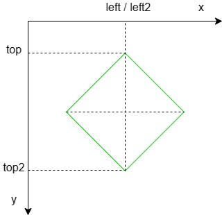

#### GUID生成规则

- 字段定义

| 63--59  |   58----49   |  48--45  | 44------------15 | 14------0 |
|:-------:|:------------:|:--------:|:----------------:|:---------:|
|  5 bit  |    10 bit    |  4 bit   |      30 bit      |  15 bit   |
| ObjType | AreaServerID | ServerID |    Timestamp     |    Inc    |

- `ObjType`枚举值

| 类型             | 值  |
|:---------------- |:--- |
| null             | 0   |
| dummy            | 1   |
| player           | 2   |
| monster          | 3   |
| npc              | 4   |
| item             | 5   |
| map              | 6   |
| team             | 7   |
| guild            | 8   |
| event            | 9   |
| scene magic      | 10  |
| system           | 11  |
| buff             | 12  |
| mail             | 13  |
| market           | 14  |
| auction          | 15  |
| pet              | 16  |
| elite monster    | 17  |
| stall_dummy      | 18  |
| player_doplganer | 19  | 

- `AreaServerID`由配置文件指定，用来区分不同区服
- `ServerID`也由配置文件指定，用来区分不同服务器
- `Timestamp`以秒为单位，当前Epoch时间减去`1640995200 (2022-01-01 00:00:00 GMT)`
- `Inc`始终保持递增，达上限后从0开始

#### 菱形区域

菱形区域就是旋转45度的正方形  


判断一个点`(x, y)`是否在菱形区域内：
```c++
bool InsideDiamond(int x, int y)
{
	// 菱形中心点坐标
	int x0 = left;
	int y0 = (top + top2) / 2;
	
	// 截距长度
	int c = abs(top - top2) / 2;

	return abs(x - x0) + abs(y - y0) < c;
}
```
